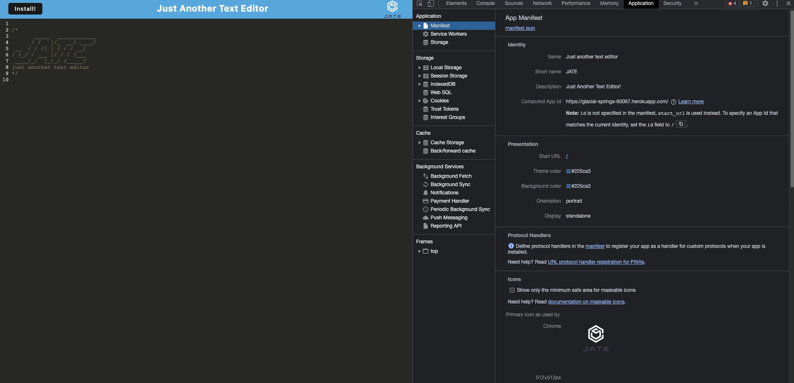

# JATE (Just Another Note Taker)

## Description

This is just another note taker app that can function offline and online. This app allows developers to write and save notes or write code snippet so that they can organize their thoughts and reliably retrieve them for later use.

## Installation

Node.js 
Install the dependencies from the command line using 'npm i'.

## Link

https://glacial-springs-60067.herokuapp.com/ 

## Usage

To use this app go to the link provided in the link section of the README. For offline use click install button on the top left corner of the page to be download in your computer.

## Credits

Kevin

## License

Please refer to the LICENSE in the repo.
